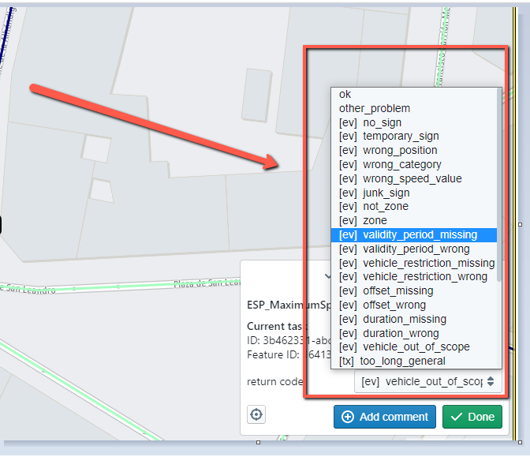

## Welcome to our fantastic team i.e. Lazy Roaders!


### PR conventions

Each PR should have a brief description and a title.

#### PR title convention
The title should be in present tense (third form) starting with the Jira task number, i.e. ADANS-XXXXX {one sentence describing the PR goal}.<br>
Some good examples:<br>
`` ADANS-7098 Adds new return codes to workflow.``<br>
`` ADANS-7845 implements retry and back-off functionality when Iris unavaliable``.<br>


#### PR description convention
The PR description should tell what was done in the scope of the PR. Consist of 3 section seperated by a **blank line**.
The fist section is required and the rest is optional. They are:
1. Hyphenated list explaining what wat was done in scope of PR.
2. (Optional) Screenshots or recording if it's UI change.
3. (Optional) Additional explanation related to the PR to help reviewer more insight im created PR.

Below you can find an example of a PR description:

```
- Added prefixes to return codes (ex/pop).
- Fixed README.md local run explanation.
- Adjusted Camunda bpmn.
```

```
Optional: Here can be some notes. For example “TODO: Return code ordering should be done later””  
```

#### PR commit message convention
Each PR commit message should contain Jira task number. FOr example:<br>
`` ADANS-4567 Implemented postpone funtionality without unit tests. Should be added in next commit.``<br>

#### Branch naming convention
For each new functionality we need to create a feature branch. There is no special agreement on this,
but it would be nice to keep the following convention: ``featire/ADANS-4567-new-return-codes``.
If we have several feature branches pushed to a remote repository, it will be easy to figure out which branch is responsible for what.
Accordingly, the bugfix branches should have ``bugfix/ADANS-4567-new-return-codes`` convention.
